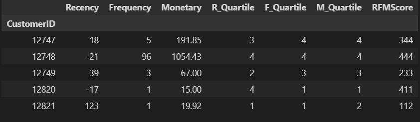

# RFM-Analysis

The aim of this project is to analyze past purchase data of customers to gain insights on their spending habits. The RFM model is applied on the dataset to cluster users based on Recency, Frequency, and Monetary quartile scores. The customers are then categorised into 6 segments which helps us identify how different sets of customers would react to new retail marketing strategies and promotions.

### Approach
Here's how the analysis was performed:
<ul>
<li> Firstly, the data was pre-processed and standardised to prepare it for the analysis.
 <li>Then the customer sales data was segregated into three attributes - Recency, Frequency, and Monetary - for each customer. 
  <li> Following are the ways those three attributes were calculated: 
   <ol>
 <li>Recency is calculated by evaluating how many days has passed since the customer's last purchase.
 <li>Frequency is calculated by checking how many invoices were registered by the same customer.
<li> Monetary is calculated by analyzing the total expenditure per invoice over a certain period of time.
  </ol>
  <li> Now that the RFM values are individually calculated for each customer, they are further segmented based on Quartile scores.
  <li>Quartile scores range from 1 to 4 and are assigned to the previously calculated Recency, Frequency, and Monetary values with 4 being the best/highest value and 1 being the worst/lowest value.
  <li>A final RFM score is calculated for each customer by simply combining the individual RFM quartile scores.
   <li> Finally, based on the final RFM score, the customers are categorised into one of six segments for further personalized marketing action.
 </ul> 

### Results
   1. RFM values, their corresponding quartile scores and their final combined RFM scores:
     
   2. The six customer segments and their corresponding count:
     
### References
This project is an implementation of the analysis shown [here](https://www.kaggle.com/sarahm/customer-segmentation-using-rfm-analysis/notebook) and the [dataset](https://www.kaggle.com/sarahm/customer-segmentation-using-rfm-analysis/data) is from an e-commerce retailer based in the UK.
